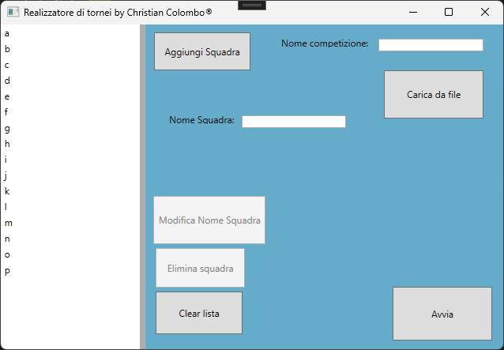

# REALIZZATORE DI TORNEI

## Autore/Author: Colombo Christian

-Scopo del software / Goal of the software:
---
Richiedere all’utente di inserire tramite un’interfaccia grafica delle squadre e un nome alla competizione, inserendole una alla volta / Ask to the user to insert with a GUI some teams and a name for the competition, inserting them one by one.
---
## Azioni possibili / Possible Actions:
- Modificare il nome di una squadra già inserita / Edit the name of an already inserted team;
- Eliminare una squadra selezionata / Delete a selected team;
- Pulire la lista eliminando tutti le squadre presenti / Clear the list deleting all the teams inside;
---
## Schermata Principale / Main Window:

---

## Schermata Di Aggiunta di una Squadra / Window to add a team:

---

## Schermata Per modificare il nome di una Squadra / Window to edit the name of a team:

### (Esempio realizzato con 2 squadre ma se ne possono inserire fino a 16 / Example created with 2 teams but up to 16 can be inserted)

---

## Schermata Principale prima di avviare la competizione / Main Window before starting the competition:

---

## Schermata Finale / Final Window:
### Per mandare avanti di uno step una squadra è necessario premere sul pulsante che la rappresenta /  To move a team forward one step you need to press the button that represents it

---

# COME UTILIZZARE IL SOFTWARE / HOW TO USE THE SOFTWARE:

1) Vai nella repository Github e premi sul tasto "Code", e copia la repository / Go to the Github repository and press the "Code" button, and copy the repository;
2) Apri Visual Studio Installer e assicurati di aver installato il seguentie pacchetto/ Open Visual Studio Installer and make Sure to have installed the following package:

3) Dopo esserti assicurato di avere il pacchetto installato, apri Visual Studio 2022 e clicca il bottone "Clona Repository" / After making sure you have the package installed, open Visual Studio 2022 and click the "Clone Repository" button;
4) Incolla il link della repository ed esegui il programma / Paste the repository link and run the program;
